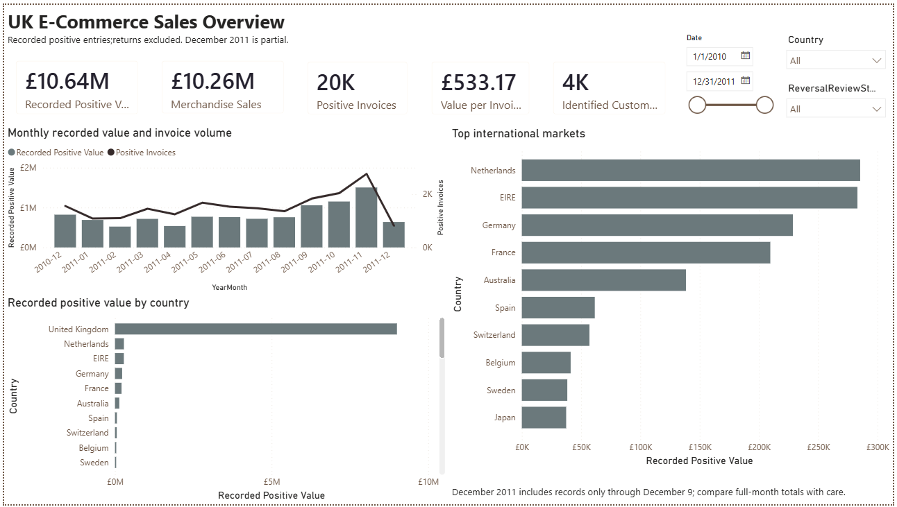

# UK E-Commerce Sales & Customer Performance

A Power BI report built from a Python-cleaned UK Online Retail dataset.

## Business questions

- How does recorded positive value vary over time?
- Which merchandise products drive sales and units?
- Which identified customers contribute the most value?
- How do countries differ in value and invoice size?
- How do two investigated reversal candidates affect the results?

## Report preview

## Report pages

1. Sales Overview
2. Product Performance
3. Customer Analysis
4. Definitions & Data Quality

## Methods

Python data preparation, Power Query type validation, a date/product
dimensional model, and DAX measures calculated from invoice-line records.

## Important definitions

Recorded positive value excludes negative entries and is not net revenue.
Named-merchandise sales additionally exclude classified charges,
accounting entries, and ambiguous MANUAL entries.

## Data-quality finding

Two exceptionally large positive lines have matching negative entries
recorded minutes later. A review-status slicer lets viewers inspect their
effect without describing the filtered result as net sales.

## Open the report

Download report/UK_Ecommerce_Performance.pbix and open it in Power BI Desktop.

To refresh, obtain the CSV exports from Task 1 and update their source
locations through Power Query's data-source settings.

## Source

https://www.kaggle.com/datasets/carrie1/ecommerce-data

## Tools

Python, pandas, Power Query, Power BI Desktop, DAX.

### Key findings

- **Recorded positive value totalled approximately £10.64 million**, while named-merchandise sales totalled **£10,255,019.18**. Merchandise analysis excludes classified postage, fees, accounting adjustments, and ambiguous MANUAL entries. These figures represent positive entries rather than net revenue after returns.

- **Named merchandise accounted for 5,561,564 units.** REGENCY CAKESTAND 3 TIER led merchandise sales, while PAPER CRAFT, LITTLE BIRDIE led recorded merchandise units. Sales and unit rankings differed, demonstrating why product performance should be assessed using both measures.

- **November 2011 recorded the highest full-month positive value and invoice volume.** The report shows stronger activity toward the end of the available period. December 2011 contains records only through December 9, so its lower total is not a comparable full-month decline.

- **The United Kingdom dominated recorded positive value.** The Netherlands and EIRE were the largest international markets by value, followed by Germany and France.

- **Identified customers contributed approximately £8.89 million**, while approximately **£1.75 million** had no CustomerID. Customer rankings therefore describe the identified subset rather than the complete recorded-value population.

- **The top five identified customers contributed 11.8% of identified-customer value.** This highlights a commercially significant group for further account analysis, while the exceptionally large positive entries require separate review before interpreting customer value.

- **The Netherlands had the highest identified value per invoice in the displayed qualifying international comparison:** **£3,036.66**, from **94 invoices and nine customers**. Australia followed at £2,429.01 and Japan at £1,969.28. These averages suggest different ordering patterns, but do not establish market profitability or justify expansion without further evidence.

- **Two exceptionally large positive invoices had matching negative entries recorded 12 and 16 minutes later.** Their combined positive value was **£245,653.20**, approximately 2.31% of all recorded positive value. The report includes a review-status filter to inspect their effect on product and customer results.

### Business implications

The findings support reviewing fulfilment capacity ahead of periods with higher invoice activity, investigating high-value customer relationships, and comparing product sales with units and purchase frequency.

International opportunities require further assessment of customer concentration, margins, delivery costs, and repeat purchasing. Likewise, low-sales products should be reviewed alongside availability, product age, and strategic importance before considering discontinuation.

### Interpretation limits

The analysis excludes negative entries from its positive-value measures and does not calculate net revenue or profit. Product portfolio groups describe the full study period and remain fixed when date filters change. Missing CustomerIDs and incomplete December coverage limit interpretation. The data does not establish the cause of the November peak or predict future demand.

## Documentation

- [Report PDF](docs/UK_Ecommerce_Report.pdf)
- [DAX measures and definitions](docs/dax_measures.md)
- [Interactive Power BI file](report/UK_Ecommerce_Performance.pbix)
